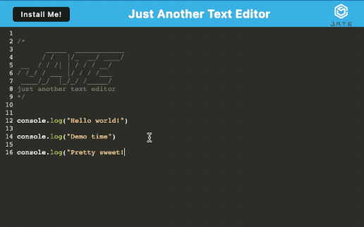

# Text Editor PWA
## Description
Text Editor is a PWA to create notes or code snippets with or without an internet connection.
## Installation
We utilized a package called idb.

## Usage

- Run the following command in your terminal to start the backend and serve the client:npm run start

- Ensure that your JavaScript files are bundled using webpack. Running the text editor application from the terminal will automatically perform this bundling process.

 After running the webpack plugins, you should have the following generated files:
 An HTML file, A service worker, A manifest file

- Open the text editor, and you will notice that IndexedDB immediately creates a database storage.

- Enter your content in the text editor, and when you click off the DOM window, the content will be automatically saved with IndexedDB.

- If you close the text editor and reopen it later, you will find that the previously entered content is retrieved from IndexedDB.

- Click on the "Install" button to download the web application as an icon on your desktop.

- When you load the web application, a service worker will be registered using Workbox, ensuring offline functionality.

- Upon loading the application, all static assets, including subsequent pages and static assets, will be pre-cached for better performance.

Image displaying app functionality:

 

## Contributors
- Used starter code from:https://github.com/coding-boot-camp/cautious-meme
## License
MIT License
Copyright (c) 2023 
## Link to Github repo: 
https://github.com/AnaCampos171/TextEditor

## Link to deployed project
